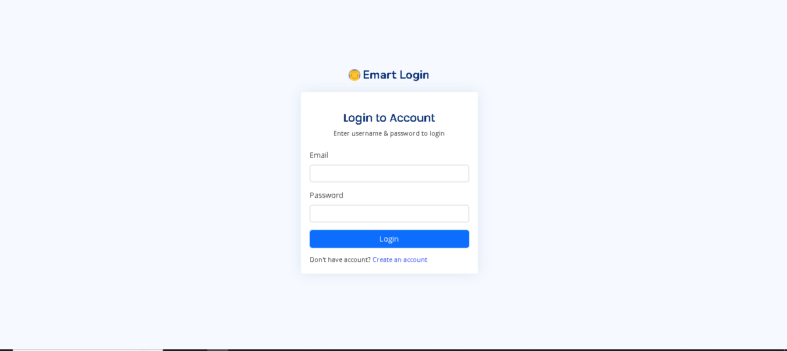
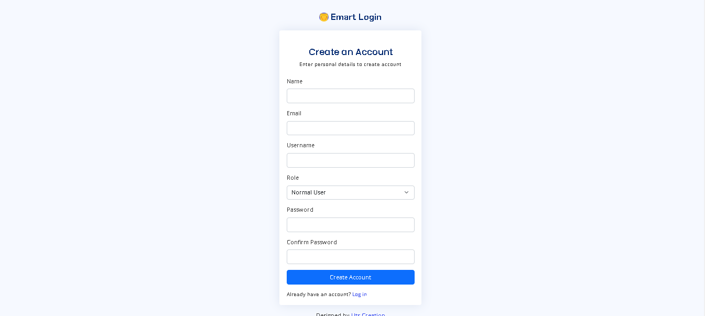
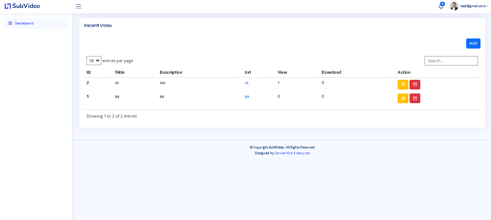
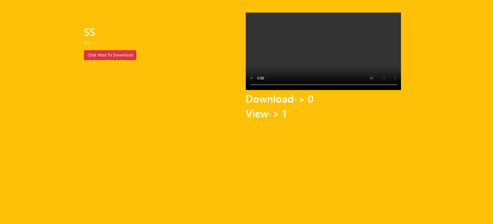

# Sub Video: Video Platform for MRs

Sub Video is a video platform designed specifically for Medical Representatives (MRs) to create, upload, and manage short videos from their dashboard. The platform provides unique links for each video and tracks views, likes, and dislikes. The application is built using Laravel and leverages DataTables for data management.







## About the Project

- **Purpose**: To provide a platform for MRs to create and share short videos with unique tracking links.
- **Technology Stack**: Laravel for backend, DataTables for data management.
- **Features**:
  - Create and upload short videos.
  - Generate unique links for each video.
  - Track video views, likes, and dislikes.
  - Dashboard for MRs to manage their videos.

## Features

- **Video Upload**: MRs can create and upload short videos from their dashboard.
- **Unique Video Links**: Each video gets a unique link that can be shared.
- **View Tracking**: Track the number of views for each video.
- **Engagement Tracking**: Track likes and dislikes for each video.
- **User Dashboard**: Personalized dashboard for MRs to manage their videos and view analytics.

## Technologies Used

- **Backend**: Laravel
- **Frontend**: HTML, CSS, JavaScript, Bootstrap
- **Database**: MySQL
- **Libraries**: DataTables for data management, Axios for HTTP requests

## Project Structure

- **app/**: Contains the core application files.
- **public/**: Publicly accessible files, such as images, JavaScript, and CSS.
- **resources/**: Views and frontend assets.
- **routes/**: Application routes.
- **storage/**: Log files and other storage.
- **tests/**: Automated tests.

## Installation

1. **Clone the Repository**

   ```bash
   git clone https://github.com/yourusername/sub-video.git
